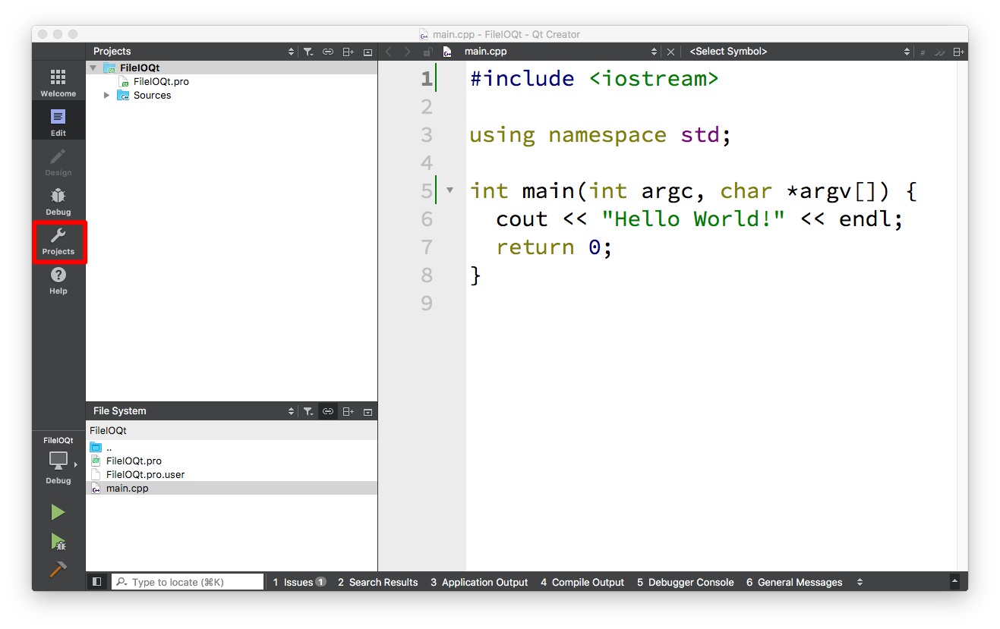
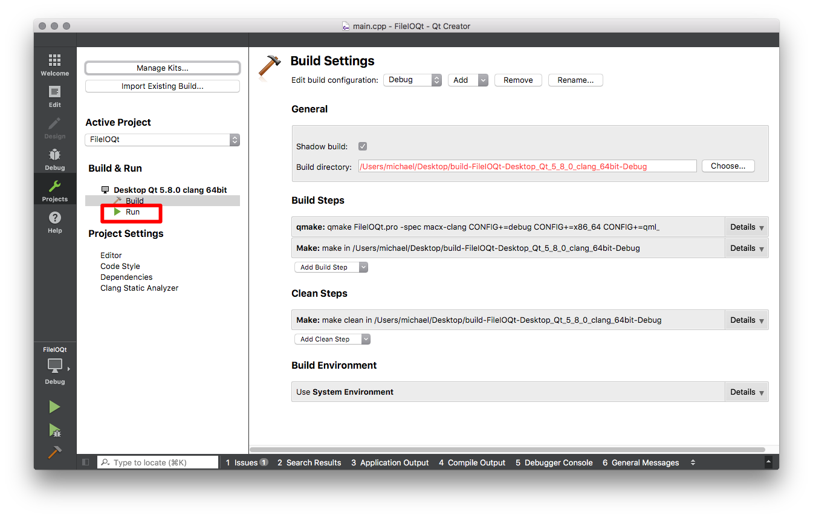
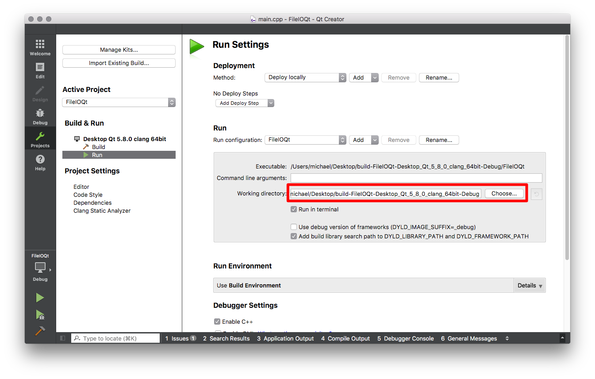
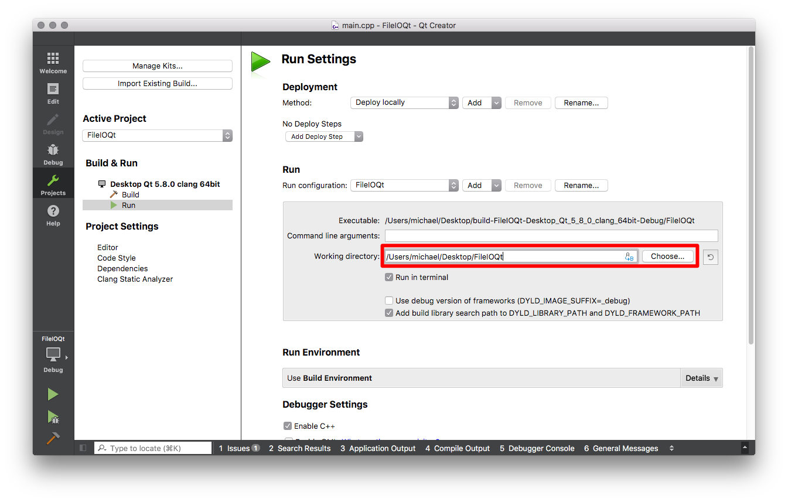

---
{
"layout": "default",
"title": "Qt Creator Fix"
}
---

# Qt Creator Change Working Directory

Normally when reading and writing files in C++ using Qt Creator you would need
to specify the full path to the file. This is annoying. If you follow the steps
on this page, your program will look in the same directory as your source file.

## Step 1

Click the projects tabs (the wrench icon).

## Step 2

Now click on the run option to change runtime settings.

## Step 3

The setting we want to change is the "working directory".

## Step 4

Click choose and select the folder that contains your source code. You can now
click edit to go back to editing your program.

