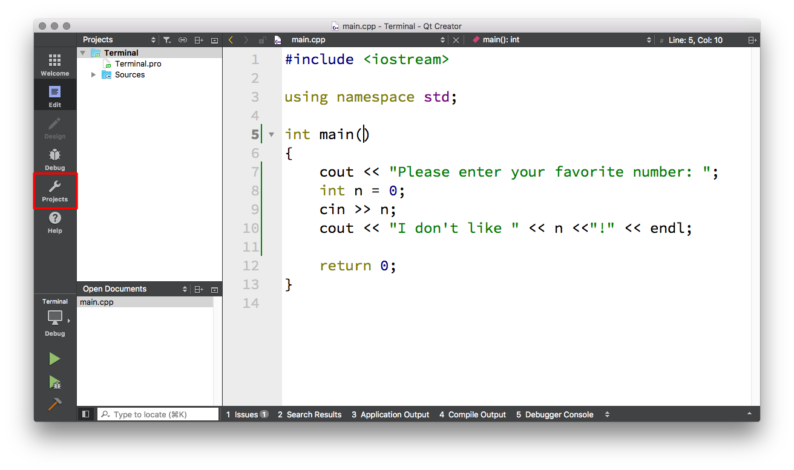
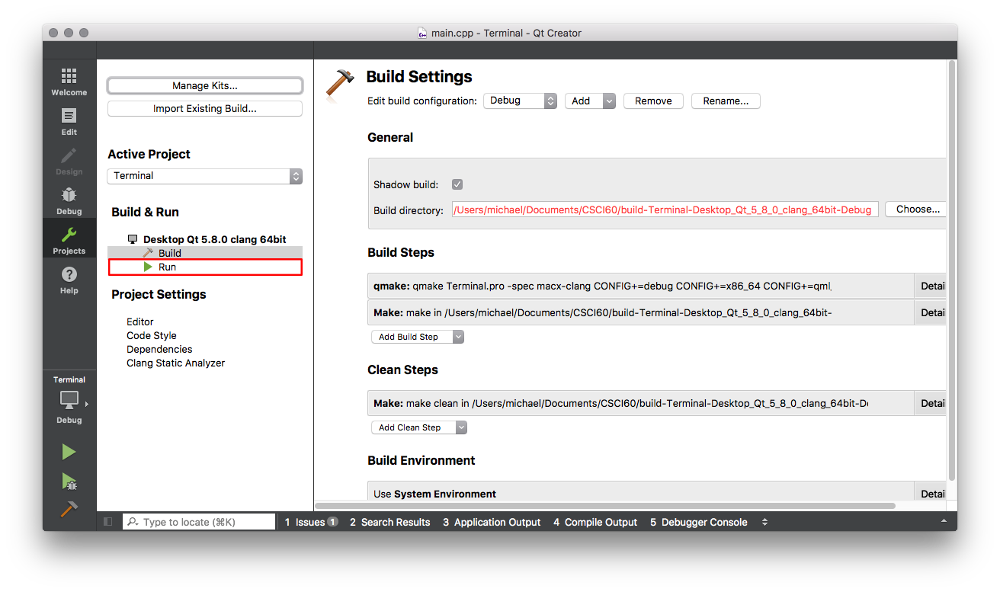
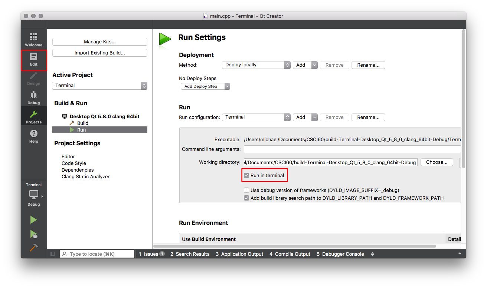

---
{
"layout": "default",
"title": "Qt Creator Fix"
}
---

# Qt Creator Terminal Fix

There is a small bug in the current version of Qt Creator which will prevent you from being able to input values into your program. However, it is not difficult to work around the bug by following the steps on this page. Unfortunately, you will need to follow these steps for every new project you create!

The screen shots below were taken on MacOS, but steps are the same on Windows 10 and Linux.

After following these steps, when you run a program it should create a new window in which your program runs and in this window you should be able to input values to your program.

## Step 1

We will be changing the settings for the project. So first click on projects button, the wrench icon (which I have placed a red box around).

## Step 2

Within the project setting we need to change a "run" setting. So click on the item labeled Run with a green arrow next to it (which I have placed a red box around).

## Step 3

Finally, we can change the setting we need to change. We need to check the box next to "Run in terminal" (which I have placed a red box around). It is probably already check, but the check is a lie! So uncheck it and then recheck it.

This project is now fixed! To go back editing your code click on the "Edit" button (which I have placed a red box around).

