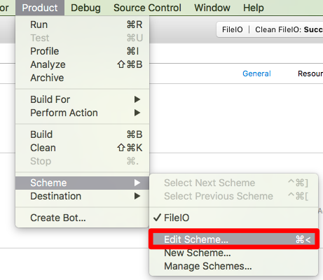
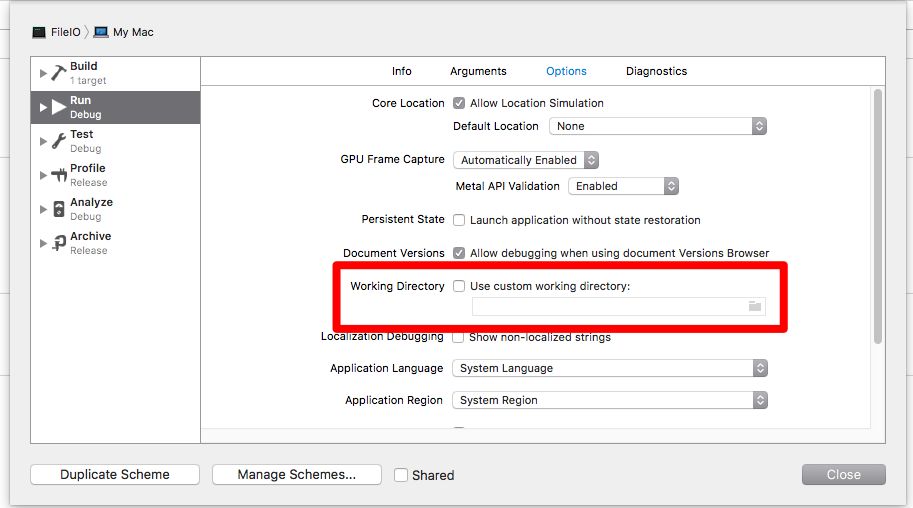
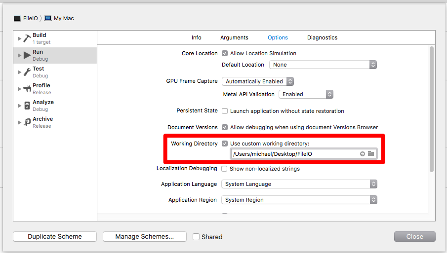

---
{
"layout": "default",
"title": "Xcode Change Working Directory"
}
---

# Xcode Change Working Directory

Normally when reading and writing files in C++ using Xcode you would need
to specify the full path to the file. This is annoying. If you follow the steps
on this page, your program will look in the same directory as your source file.

## Step 1

Navigate the menus as shown to go to _Edit Scheme_.

## Step 2

Our goal is to change the working directory. 

## Step 3

Check the box that says you want to _Use custom working directory_ and click the
folder icon to open the folder picker window. Choose the folder that holds your
source files. You are all set now.

