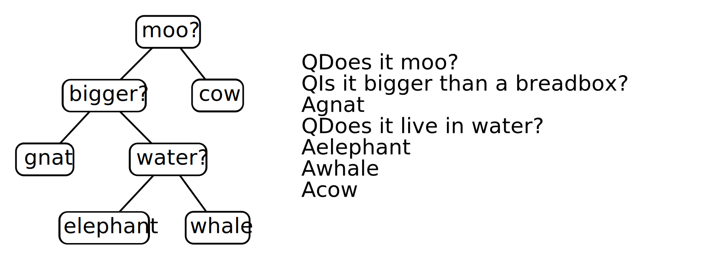

# Assignment 11: Animals Game (Twenty Questions)

## Due on May 1

## You may work with a partner on this project.

## Groups of three or more will not be allowed.

---

<div class="warning" markdown="1">
## Warning: `make memcheck` only seems to work on the lab computers in 229
</div>

## Objectives

While working on this assignment, you will:

- Gain experience programming in C
- Gain experience working with heap-allocated memory
- Gain more experience with tree data structures and recursive methods
- Implement a basic Artificial Intelligence algorithm

## Description

In this assignment we will play a guessing game (somewhat similar to 20 questions), with the computer doing the guessing---and learning at the same time. In the sample below, the human's responses are shown after the question marks.

```text
Welcome to the Animals game!

Shall we play a game? y
Were you thinking of a elephant? n
Doh! What was the animal? cow
What question separates cow from elephant? Does it moo?
What is the correct answer for this animal? y

Shall we play a game? y
Does it moo? y
Were you thinking of a cow? y
Great!

Shall we play a game? y
Does it moo? n
Were you thinking of a elephant? n
Doh! What was the animal? gnat
What question separates gnat from elephant? Is it bigger than a breadbox?
What is the correct answer for this animal? n

Shall we play a game? y
Does it moo? n
Is it bigger than a breadbox? y
Were you thinking of a elephant? n
Doh! What was the animal? whale
What question separates whale from elephant? Does it live in the water?
What is the correct answer for this animal? y

Shall we play a game? n
Bye!
```

The program maintains a binary tree whose internal nodes contain questions and whose leaves contain the names of animals. The left and right children of an internal node correspond to the responses "no" and "yes" (left being no and right be yes). When the program makes a wrong guess, it collects enough information to create a new node. The original leaf (the one with a wrong answer) is replaced by a new internal node that contains a new question and whose children are the old wrong answer and the new right answer.

_Notice that the tree has the property that a node is either a leaf or has two children._ That property makes it easy to distinguish answers from questions. It also allows us to store trees as text files, with the nodes listed in _preorder_. Here is a picture and the corresponding textual representation of a simple tree:



The lines in the file follow a preorder traversal of the tree. A question is prefixed by the letter `Q` and an answer by `A`. Do not specify empty trees in the file as they do not provide useful information. The shortest possible file has one line, an answer.

## Files

This program has three `*.c` files `binary_tree_io.c`, `binary_tree.c`, and `animal_game.c`. The corresponding header files have been provided. It will be helpful to look at Bailey’s implementation of a binary tree (source code is available on the course "Documentation and Handouts" page).
In general, all the nodes/trees will be created with `malloc` and all the variables will be of type `binary_tree*`, i.e., pointers to `binary_tree` structs. You will be working with the following C libraries: `stdlib.h`, `stdio.h`, `stdbool.h` and `string.h`. Make sure you look over the documentation for these libraries. Additionally, you may use the POSIX functions discussed in lab an lecture.

### `binary_tree_io.c`

The file `binary_tree_io.c` provides functions to read and write a data file named `animals.tree` which stores the binary tree between runs of the program. The function declarations are provided in the file `binary_tree_io.h`.

This file will be the shortest and simplest. The header file specifies two functions: `binary_tree_create_f` and `binary_tree_write`. Both of these functions take a file stream, and call a recursive function to do the work. You can use `binary_tree_write` to print the tree while debugging by setting the stream to `stdout`. The equivalent Java methods are in the class `AnimalTree`.

The function `binary_tree_create_f` should return `NULL` if,

- The input stream does not represent a pre-order traversal of a binary tree
- There is a line in the input file that does not begin with `Q` or `A`
- There is a blank line in the input file (i.e. a line with a newline only)
- Any other unexpected error occurs

As in our Java version, the easiest way to implement these methods is to write recursive helper methods. The recursive functions will reflect the steps in a preorder traversal. The only parts to fill in are the file operations and the `binary_tree` manipulations. You may write your own auxiliary functions as necessary.

### `binary_tree.c`

The file `binary_tree.c` provides the implementations for the `binary_tree` functions. The struct `binary_tree` is forward declared in `binary_tree.h`, so it is only possible to work with binary trees through pointers. Each node in the binary tree contains a single string (`char*`).

There are many functions to implement for working with `binary_tree` structs but most of them are short and simple. Completing this part is mostly a task in translating your knowledge of binary trees into C. As a result, you will likely want to refer to the implementation of the class `BinaryTree.java` in Bailey’s structure library. Note: you may not have to use some of the functions, like height and depth, but include them anyway (we may test them).

You must be very clear on how the different types of nodes are identified. Here is the suggested convention:

- An _empty tree_ is just a `NULL` pointer
- A _leaf_ is a non-empty node whose left and right children are `NULL`.
- A _root_ is a non-empty node whose parent is `NULL`.

The tree nodes contain answers and questions. Answers are at leaf nodes and questions are at non-leaves. As in the Java version, do not add any additional information to the nodes to tell them apart. In particular, do not store in a node the leading character, `A` or `Q`, from the `animals.tree` file.

Notice that there is no `binary_tree_set_string` function. We want you to construct the trees by detaching subtrees and reassembling them. The greatest challenge is to maintain the parent pointers properly when executing `binary_tree_set_left` and `binary_tree_set_right`. Again, it will be useful to look at the Java `BinaryTree` implementation in the `structure5` library, which can be found via the link on the class handouts web page.

### `animal_game.c`

This file, and its corresponding header files, will hold functions implementing the game logic of the Animal game. You should decompose the logic of the game into small testable functions which will be called in the main method (found in `main.c`). One variation from our Java version is that we won't deal with input and output from the command line. Instead, when your game starts it should read from a file named `data/animals.tree` and when the game finishes it should update this file, that is, write the final tree to `data/animals.tree`. If the file `animal.tree` is not found, then you should start with a game tree containing only elephant at the root.

## Getting started

You may work in pairs for this assignment, and it is recommended to do so. You will likely encounter subtle bugs during the course of this assignment, and more eyes on the code will hopefully help.

Read through this entire document to make sure you understand the assignment. A Java implementation of the Animal game can be found with the starter code.

The focus of your work will be to rewrite this Java program into C. The starter files for this assignment can be found in the usual location.

Look at the different header files and make sure you understand the basics of what the interface is doing. Note: you may __not__ change the header files provided and your program must compile with these header files.

## Memory management in the `binary_tree` class

One of most delicate aspects of C programming is making sure that all memory allocated with `malloc` is properly freed with `free`. One must avoid stale pointers and memory leaks. You can check for memory leaks using [valgrind](http://valgrind.org/) by using the command `make memcheck`. If you want to do this from home, you will need to install valgrind. We will cover using valgrind in lab.

In our `binary_tree` class, the only job of `binary_tree_destroy` is to delete all dynamically- constructed subtrees. This function should be implemented recursively and free nodes in post- order. Make sure you understand why the order of freeing needs to be post order. Also, if you are using a single empty tree make sure you don’t free it while freeing your tree.

## Grading

| Criterion | Points |
|-----------|--------|
| binary_tree_io | 4 |
| binary_tree | 6 |
| Animal Game | 5 |
| checking preconditions | 2 |
| appropriate comments (including JavaDoc) | 2 |
| no memory leaks | 2 |
| style and formatting | 1 |
| submitted correctly | 1 |

## Submitting your work

You will turn in your assignment in a folder named `Assignment11_LastNameFirstName` if you are working with a partner change the folder name to `Assignment11_LastNameFirstName1_LastNameFirstName2` and drag it to the dropbox. Before submitting your code make sure your code compiles and that the files are well-documents with Javadoc style comments.
