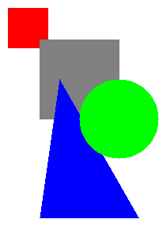

Project 3: Painting a picture
=============================
-----------------------------

Overview
--------
In this project you will be implementing a simple 2D-rendering algorithm know as the [painter's algorithm](https://en.wikipedia.org/wiki/Painters_algorithm). As input to this algorithm your program will take a scene, i.e., a collection of 2D-shapes (e.g., circle, rectangles and triangles) and an associated depth for each shapes. The algorithm then produces a drawing of the scene respecting the occlusions between shapes. To achieve this the algorithm first draws more distance shapes and then on top of these exiting shapes draws closer shapes. The output image format we will be using is PPM an ASCII based image format, described below. The image viewer ristretto can open such images and has been installed on your virtual machine.

The algorithm
-------------

#### Input
The input to the algorithm consists of

* __min\_y__, __max\_y__: the range of y-coordinates is [min\_y, max\_y] (increasing downward)
* __min\_x__, __max\_x__: the range of x-coordinates is [min\_x, max\_x] (increasing rightward)
* __max\_depth__: the range of depth values is [0, max\_depth] (increasing toward the viewer's eye)
* A collection of shapes with depth values

#### Output
The output of the algorithm is a coloring of the pixels, representing the scene. The pixels are stored in an __(max\_x - min\_x + 1)__ by __(max\_y - min\_y + 1)__ 2D-array.

#### Pseudocode
The algorithm given in pseudo code below consists of four nested for loops. There are many optimizations one can make to this algorithm (see CS 164), but for this project we will just use this basic version.

    for y from min_y to max_y:
        for x from min_x to max_x:
            for d from 0 to max_depth:
                for each shape S at depth d:
                    if point (x,y) intersects S:
                        color pixel associated with (x,y) the color of S

__Warning:__ This algorithm will be fairly slow, possibly taking a few minutes for larger inputs, especially when run with __memcheck__.

File formats
------------
As was the case in [Project 2](../project2), the input and output files for this project will have a rigid format. When parsing the input files you may assume it will be exactly as specified below, including whitespace. We will assume the same about your output.

#### Input format
Each line of the input file will start with one of sixe commands: __COLOR__, __CANVAS__, __DEPTH__, __RECTANGLE__, __SQUARE__ and __CIRCLE__, followed by parameter described below.

* __COLOR red green blue__: Sets the current color
    * __red__: an __int__ in the range [0,255] representing the red value
    * __green__: an __int__ in the range [0,255] representing the green value
    * __blue__: an __int__ in the range [0,255] representing the blue value

* __CANVAS x1 y1 x2 y2__: Sets the viewing canvas size
    * __x1__: an __int__ representing the x-value of the left boundary
    * __y1__: an __int__ representing the y-value of the top boundary
    * __x2__: an __int__ representing the x-value of the right boundary
    * __y2__: an __int__ representing the y-value of the bottom boundary

* __DEPTH depth__: Sets the current depth
    * __depth__: an __int__ in the range [0,15] representing the current depth

* __RECTANGLE x1 y1 x2 y2__: Adds a rectangle to the scene using current depth and color
    * __x1__: an __int__ representing the x-value of the left boundary
    * __y1__: an __int__ representing the y-value of the top boundary
    * __x2__: an __int__ representing the x-value of the right boundary
    * __y2__: an __int__ representing the y-value of the bottom boundary

* __CIRCLE x1 y2 r__: Adds a circle to the scene using current depth and color
    * __(x1, y1)__: center of the circle
    * __r__: radius of the circle

* __TRIANGLE x1 y1 x2 y2 x3 y3__: Adds a triangle to the scene using the current depth and color
    * __(x1, y1)__: first vertex of the triangle
    * __(x2, y2)__: second vertex of the triangle
    * __(x3, y3)__: third vertex of the triangle

The first line of a file will always be a __COLOR__ command, which sets the background color. The second line will always be a __CANVAS__ command, and this will be the only __CANVAS__ command. The third line will always be a __DEPTH__ command setting the initial depth. An example file would be:

    COLOR 255 255 255
    CANVAS 0 0 200 300
    DEPTH 0
    COLOR 255 0 0
    RECTANGLE 10 10 60 60
    COLOR 0 255 0
    DEPTH 35
    CIRCLE 150 150 50
    COLOR 0 0 255
    DEPTH 30
    TRIANGLE 50 275 175 275 75 100
    COLOR 128 128 128
    DEPTH 15
    RECTANGLE 50 50 150 150

This file produces the following image:

#### Output format
The output format is the image format know as [Plain PPM](http://netpbm.sourceforge.net/doc/ppm.html). This is a convenient format for us, as it is simply a text file and you already know how to write to text files from [Project 2](../project2). The first line of a Plain PPM file consists of the two characters "P3". This is known as a __magic number__ and lets the image viewer know what format you are using. The next line consists of two __int__s, the first is the __width__ of the image and the second is the __height__. The third line will always be 255 for you, and represents the maximum value of a color channel. Now, there are __height__ many more lines, each consisting of __width__ many triples of __int__s representing the color of the pixel at this position. For an example see [http://en.wikipedia.org/wiki/Netpbm_format#PPM_example](http://en.wikipedia.org/wiki/Netpbm_format#PPM_example) and the examples included in the __tar.gz__ for this project.

Your task
---------
Your task is essentially the same as [Project 2](../project2).

1. Parse the input file so that it may be used in the painter's algorithm
2. Implement the painter's algorithm
3. Output the PPM file

In addition, your code should logically organized into separate objects and functions grouped into files. In the end, we should be able to use the command

    make run < input.dat > output.ppm

where __input.dat__ is properly formated and get a properly formated __output.ppm__ that can be opened in ristretto.

#### Rules
For this project you may not use any C++ container classes or automatic memory management features. Part of the purpose of this project is to learn about manual memory management with objects. Thus, the only libraries (other than ones you wrote) you may include are __iostream__, __string__ and __sstream__.

You program must run without any memory leaks, segfaults, or other memory access errors. To make sure that your code does not have memory errors you should test your program with the command

    make memcheck < inputfile > outputfile

which will produce a memory diagnostics report for your program.

#### Starter code
The starter code for this project include the beginnings of an object oriented solution to this problem. In particular, it include a abstract class called __Shape__ from which we have a subclass __Triangle__ to be used for triangles. You should use the class __Triangle__ as an example on which to base a __Rectangle__ and __Circle__ class. You are free to modify this code to suit your needs for the project. Also, you will also want to modify the __ArrayList__ example from class to be used to contain your shapes as you parse the file.

Project 3 starter code: [project3.tar.gz](project3.tar.gz)

You can download this file from a terminal with:  
__wget "http://www.ics.uci.edu/~mbannist/teaching/ics45c/project3/project3.tar.gz"__
    

